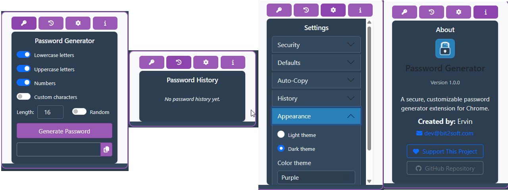
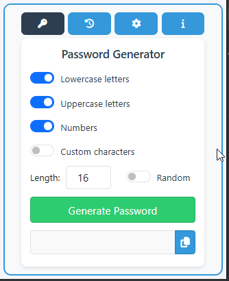
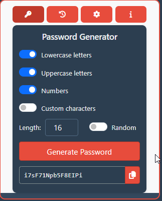
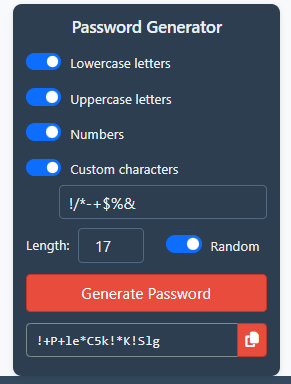
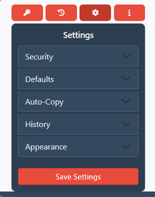

# Secure Password Generator

A Chrome extension that generates strong, customizable passwords with built-in password history and encryption.



## Features

- **Strong Password Generation**: Create secure passwords with custom length and character sets
- **Customizable Options**: Include lowercase, uppercase, numbers, and custom characters
- **Password History**: Save generated passwords for later reference
- **Local Encryption**: Encrypt your password history for added security
- **Dark Mode**: Choose between light and dark themes for comfortable viewing
- **Color Themes**: Personalize your extension with different color schemes

## Screenshots

| Light Theme | Dark Theme |
|-------------|------------|
|  |  |

### Password Generation


### Settings Panel


## Installation

### Chrome Web Store
1. Visit the [Chrome Web Store](https://chrome.google.com/webstore) (link will be updated once published)
2. Click "Add to Chrome"
3. The extension will be installed and appear in your extensions toolbar

### Manual Installation
1. Download the latest release from the [Releases page](https://github.com/sirdree/Secure-Password-Generator_Chrome/releases/tag/v.1)
2. Unzip the file
3. Open Chrome and go to `chrome://extensions/`
4. Enable "Developer Mode" in the top-right corner
5. Click "Load unpacked" and select the unzipped folder
6. The extension will be installed and appear in your extensions toolbar

## Usage

### Generating Passwords

1. Click the extension icon in your toolbar
2. Configure your password options:
   - Select character types (lowercase, uppercase, numbers, custom)
   - Set password length (12-36 characters)
   - Enable random length for more unpredictable passwords
3. Click "Generate Password"
4. Copy the password using the copy button

### Viewing Password History

1. Click the history tab (clock icon)
2. View your previously generated passwords
3. Copy or delete individual passwords as needed
4. Use "Clear All History" in settings to remove all saved passwords

### Customizing Settings

1. Click the settings tab (gear icon)
2. Adjust security settings:
   - Require special characters for stronger passwords
   - Avoid ambiguous characters (1, l, I, 0, O) for better readability
   - Enable password encryption for stored history
3. Set default options for new passwords
4. Configure auto-copy options
5. Manage history settings and preferences
6. Change appearance (light/dark theme and color scheme)

## Security Features

### Password Encryption

When enabled, all passwords in your history are encrypted using AES-GCM 256-bit encryption via the Web Crypto API:

- Each password is encrypted with a unique initialization vector
- Encryption is performed locally within the extension
- Encrypted passwords cannot be viewed from Chrome's storage
- Decryption happens automatically when viewing history

### Privacy

- All data is stored locally in your browser
- No data is transmitted to external servers
- No tracking or analytics
- No permissions beyond what's needed for core functionality

## Technical Details

### Technologies Used

- **Frontend**: HTML, CSS, JavaScript
- **UI Framework**: Bootstrap 5
- **Icons**: Font Awesome
- **Storage**: Chrome Storage API
- **Encryption**: Web Crypto API (AES-GCM)

### Directory Structure

```
secure-password-generator/
├── icons/                              # Extension icons
├── assets/
│   ├── css/                            # CSS files
│   │   ├── bootstrap.min.css
│   │   ├── fontawesome.min.css
│   │   ├── styles.css
│   │   └── theme.css
│   ├── js/                             # JavaScript files
│   │   ├── popup.js
│   │   ├── encryption.js
│   │   └── accordion-fix.js
│   └── webfonts/                       # Font Awesome webfonts
├── popup.html                          # Main extension interface
├── bootstrap-init.js                   # Bootstrap initialization
├── background.js                       # Background service worker
└── manifest.json                       # Extension manifest
```

## Development

### Prerequisites

- Chrome browser
- Basic knowledge of HTML, CSS, and JavaScript
- Text editor or IDE (VS Code recommended)

### Setup for Development

1. Clone this repository:
   ```
   git clone https://github.com/sirdree/Secure-Password-Generator_Chrome.git
   ```

2. Open Chrome and navigate to `chrome://extensions/`

3. Enable "Developer Mode" in the top-right corner

4. Click "Load unpacked" and select the cloned repository folder

5. Make changes to the code and reload the extension to see updates

### Building for Production

1. Ensure all files are minified for production
2. Create a zip file containing all necessary files
3. Submit to the Chrome Web Store or distribute for manual installation

## Contributing

Contributions are welcome! Please feel free to submit a Pull Request.

1. Fork the repository
2. Create your feature branch (`git checkout -b feature/amazing-feature`)
3. Commit your changes (`git commit -m 'Add some amazing feature'`)
4. Push to the branch (`git push origin feature/amazing-feature`)
5. Open a Pull Request

## License

This project is licensed under the MIT License - see the [LICENSE](LICENSE) file for details.

## Acknowledgments

- Bootstrap for the UI components
- Font Awesome for the icons
- All contributors and users of this extension

---

Made with ❤️ by [Ervin]

## Do you like my work? Consider supporting me...

[Support me via PayPal](https://www.paypal.com/donate/?hosted_button_id=GJGXEPFP2SWFW)

- or using this QR Code

